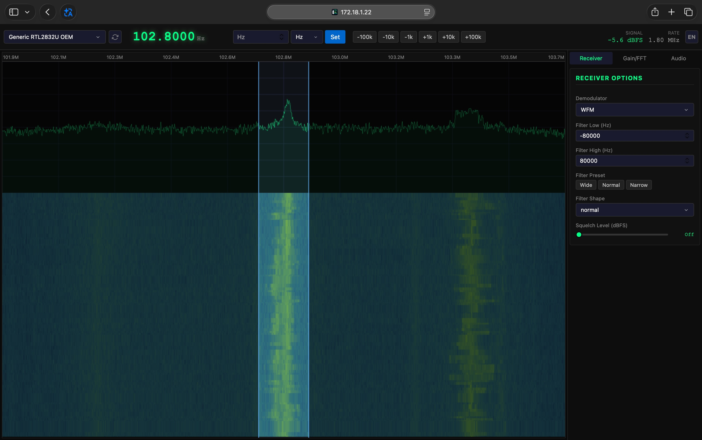
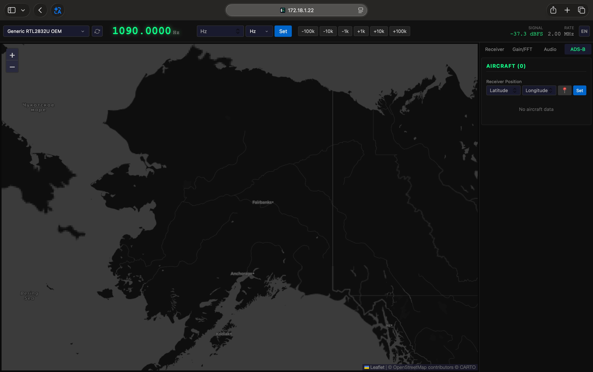

# Go RTL-SDR Monitor

A Go-based SDR receiver inspired by [gqrx](https://github.com/gqrx-sdr/gqrx), with a web UI for remote operation and single-binary deployment. Supports broadcast FM/AM/SSB/CW, ADS-B aircraft tracking, and NOAA weather satellite APT imagery decoding.





## Features

- **RTL-SDR Support** — Built on [go-rtl-sdr](https://github.com/ntklink/go-rtl-sdr) CGO bindings; multi-device support via a pluggable `SDRDevice` interface
- **Web UI** — Vue 3 + [Reka UI](https://github.com/unovue/reka-ui), embedded into the Go binary via `//go:embed`
- **Real-time Spectrum & Waterfall** — Canvas-rendered, streamed over WebSocket with configurable FFT size, rate, averaging, and max-hold
- **Browser Audio Playback** — Demodulated PCM audio streamed over WebSocket, played with the Web Audio API
- **14 Demodulation Modes** — OFF, Raw I/Q, AM, AM-Sync, LSB, USB, CW-L, CW-U, NFM, WFM, WFM-Stereo, WFM-OIRT, ADS-B, NOAA APT (gqrx-compatible + satellite)
- **ADS-B Reception** — Decode Mode S Extended Squitter (1090 MHz) messages: Manchester decoding, CRC verification with single-bit error correction, CPR (Compact Position Reporting) position decoding, aircraft tracking with callsign/altitude/speed/heading/vertical-rate extraction
- **NOAA APT Weather Satellite** — Decode APT (Automatic Picture Transmission) imagery from NOAA polar-orbiting satellites (NOAA-15/18/19 at 137 MHz): 2.4 kHz subcarrier AM demodulation, sync frame detection, real-time image line-by-line rendering, satellite frequency quick-select, PNG export
- **Live Aircraft Map** — Leaflet-based map showing nearby aircraft positions with locale-aware tile layers (OpenStreetMap / AutoNavi); auto-requests browser geolocation for receiver position
- **Full DSP Chain** — DDC, FIR bandpass filtering, AGC with presets, anti-aliased audio resampling
- **gqrx-compatible Parameters** — AGC presets (Off/Slow/Medium/Fast), filter presets (Wide/Normal/Narrow), filter shapes (Soft/Normal/Sharp), CW offset, WFM de-emphasis
- **Internationalization** — English / Chinese UI with locale toggle
- **State Recovery** — All settings are synced from the backend on page refresh; audio playback survives tab switches

## Architecture

```
RTL-SDR → IQ Stream → ┌→ FFT (spectrum/waterfall) → WebSocket → Canvas
                      └→ DDC → Bandpass Filter → Demod → AGC → Resampler → WebSocket → Web Audio API
                      └→ ADS-B Decoder → Aircraft Tracker → WebSocket → Leaflet Map
                      └→ FM Demod → APT Decoder (2.4kHz AM subcarrier) → WebSocket → Canvas Image
```

### DSP Signal Chain

| Stage | File | Description |
|-------|------|-------------|
| Source | `sdr/source.go` | RTL-SDR async read, 8-bit IQ → complex128 |
| Device Abstraction | `sdr/device.go` | `SDRDevice` interface, `DeviceManager` for enumeration & hot-swap |
| FFT | `sdr/fft.go` | Custom radix-2 Cooley-Tukey FFT, Hann window, max-hold with decay |
| DDC | `sdr/ddc.go` | Digital down-converter (NCO + FIR low-pass + decimation) |
| Filter | `sdr/filter.go` | Windowed-sinc FIR design (low-pass / band-pass / complex band-pass) |
| Demodulator | `sdr/demod/` | FM, WFM (mono/stereo/OIRT), AM, AM-Sync (PLL), SSB |
| AGC | `sdr/agc.go` | AGC with hang, gqrx-matched presets |
| Resampler | `sdr/resampler.go` | Anti-aliased FIR + linear interpolation to 48 kHz |
| Receiver | `sdr/receiver.go` | Top-level orchestration, per-client pub/sub for FFT & audio |
| ADS-B Decoder | `adsb/decoder.go` | IQ → preamble detection → Manchester decoding → CRC verification |
| ADS-B Messages | `adsb/message.go` | Callsign, altitude, airborne position, velocity extraction |
| ADS-B CPR | `adsb/cpr.go` | Compact Position Reporting (global + relative) decoding |
| ADS-B CRC | `adsb/crc.go` | Mode S 24-bit CRC with single-bit error correction |
| ADS-B Tracker | `adsb/tracker.go` | Multi-aircraft tracking, ICAO-based state merging, CPR caching |

## Build

### Prerequisites

```bash
# RTL-SDR library and headers
sudo apt install librtlsdr-dev libusb-1.0-0-dev

# Go 1.22+ and Node.js 18+
```

### Makefile (recommended)

```bash
make build    # Build complete single binary (frontend + backend) → bin/
make run      # Build and run
make web      # Build frontend only
make dev      # Start Vite dev server (proxies API to backend)
make clean    # Clean build artifacts
```

### Manual Build

```bash
cd web && npm install && npm run build    # Frontend → web/dist/
go build -trimpath -ldflags="-s -w" -o bin/go-rtl-sdr-mon .
```

### Cross-Compilation (Multi-Architecture)

Cross-compilation uses Docker Buildx + QEMU to build for `linux/amd64`, `linux/arm64`, and `linux/arm` (armv7). Since the project uses CGO (librtlsdr), a C toolchain for each target architecture is required — Docker handles this automatically.

**Prerequisites:**

```bash
# Install QEMU binfmt handlers (one-time, for cross-architecture emulation)
docker run --privileged --rm tonistiigi/binfmt --install all

# Create a Docker Buildx builder that supports all platforms
docker buildx create --name mybuilder --use --driver docker-container
docker buildx inspect --bootstrap
```

**Build commands:**

```bash
make build-amd64    # → bin/go-rtl-sdr-mon-linux-amd64  (x86_64)
make build-arm64    # → bin/go-rtl-sdr-mon-linux-arm64  (aarch64)
make build-arm      # → bin/go-rtl-sdr-mon-linux-arm    (armv7)
make build-all      # All three architectures

make dist           # Build all + package into tarballs in dist/
```

### GitHub Releases

Releases are automated via GitHub Actions (`.github/workflows/release.yml`). Push a tag to trigger a release:

```bash
git tag v1.0.0
git push origin v1.0.0
```

The workflow builds all three architectures in parallel, creates `.tar.gz` archives with SHA256 checksums, and publishes a GitHub Release with auto-generated release notes.

You can also trigger a release manually from the Actions tab (Workflow Dispatch) by specifying a tag name.

## Usage

```bash
# Defaults: device 0, 1.8 MHz sample rate, 102.8 MHz, port 8080
./go-rtl-sdr-mon

# Custom parameters
./go-rtl-sdr-mon -device 0 -freq 144500000 -samplerate 2400000 -port 8080 -ppm 1

# Manual gain
./go-rtl-sdr-mon -autogain=false -gain 248  # 24.8 dB (gqrx default)
```

Open `https://localhost:8080` in your browser.

> The server uses HTTPS by default (required for browser geolocation). A self-signed certificate (`cert.pem` / `key.pem`) is auto-generated in the binary's directory on first run. Accept the browser's security warning to proceed. Use `-tls=false` to disable.

### CLI Flags

| Flag | Default | Description |
|------|---------|-------------|
| `-device` | `0` | RTL-SDR device index |
| `-samplerate` | `1800000` | Sample rate in Hz (gqrx default: 1.8 MHz) |
| `-freq` | `102800000` | Center frequency in Hz (default: 102.8 MHz) |
| `-port` | `8080` | HTTP server port |
| `-tls` | `true` | Use HTTPS (auto-generates self-signed cert if needed) |
| `-autogain` | `true` | Enable SDR auto gain |
| `-gain` | `248` | Manual gain in 0.1 dB (248 = 24.8 dB, gqrx default) |
| `-ppm` | `0` | Frequency correction in ppm |

## API Reference

### REST

| Method | Endpoint | Body | Description |
|--------|----------|------|-------------|
| GET | `/api/device` | — | Active device info |
| GET | `/api/devices` | — | List available devices |
| POST | `/api/device/select` | `{"id":"..."}` | Select / open a device |
| GET | `/api/status` | — | Receiver status & config |
| GET | `/api/demods` | — | Available demodulator list |
| POST | `/api/frequency` | `{"frequency":100000000}` | Set center frequency |
| POST | `/api/demod` | `{"demod":"NFM"}` | Set demodulator |
| POST | `/api/filter` | `{"low":-5000,"high":5000}` | Set filter cutoffs |
| POST | `/api/filter-offset` | `{"offset":0}` | Set filter offset |
| POST | `/api/filter-shape` | `{"shape":"normal"}` | Set filter shape (soft/normal/sharp) |
| POST | `/api/filter-preset` | `{"preset":"normal"}` | Set filter preset (wide/normal/narrow) |
| POST | `/api/squelch` | `{"level":-80}` | Set squelch level (dBFS) |
| POST | `/api/agc` | `{"enabled":true}` | Enable/disable AGC |
| POST | `/api/agc-preset` | `{"preset":"medium"}` | Set AGC preset (off/slow/medium/fast) |
| POST | `/api/gain` | `{"gain":248}` | Set manual gain (0.1 dB) |
| POST | `/api/auto-gain` | `{"auto":true}` | Enable/disable SDR auto gain |
| POST | `/api/freq-correction` | `{"ppm":1}` | Set frequency correction |
| POST | `/api/cw-offset` | `{"offset":700}` | Set CW/BFO offset (Hz) |
| POST | `/api/spectrum-avg` | `{"avg":0.3}` | Set FFT averaging factor |
| POST | `/api/fft-size` | `{"size":8192}` | Set FFT size |
| POST | `/api/fft-rate` | `{"rate":25}` | Set FFT refresh rate (fps) |
| POST | `/api/fft-max-hold` | `{"enabled":true}` | Enable/disable max-hold |
| POST | `/api/receiver-position` | `{"latitude":39.9,"longitude":116.4}` | Set receiver position (for ADS-B CPR) |
| GET | `/api/aircraft` | — | Current tracked aircraft list |
| GET | `/api/noaa/satellites` | — | List of NOAA APT satellites |
| GET | `/api/apt-stats` | — | APT decoder statistics |
| POST | `/api/apt-reset` | `{}` | Clear APT image buffer |

### WebSocket

| Endpoint | Format | Description |
|----------|--------|-------------|
| `/api/ws/fft` | Binary: `4-byte size` → `float32[]` frames | FFT spectrum data |
| `/api/ws/audio` | Binary: `1-byte channels` + `4-byte count` + `int16[]` samples | Audio PCM |
| `/api/ws/status` | JSON | Receiver status updates (500 ms interval) |
| `/api/ws/aircraft` | JSON: `Aircraft[]` | ADS-B aircraft positions (broadcast every 10 blocks) |
| `/api/ws/apt` | Binary: `4-byte lineNum` + `2080-byte pixels` | NOAA APT image lines |

## Project Structure

```
├── main.go                  # Entry point, CLI flags, server startup
├── server.go                # HTTP API + WebSocket handlers
├── Makefile                 # Build script (output → bin/)
├── sdr/
│   ├── device.go            # SDRDevice interface, DeviceManager
│   ├── source.go            # RTL-SDR implementation of SDRDevice
│   ├── receiver.go          # Top-level receiver orchestration
│   ├── fft.go               # Custom radix-2 complex FFT
│   ├── ddc.go               # Digital down-converter
│   ├── filter.go            # FIR/IIR filter design
│   ├── agc.go               # Automatic gain control
│   ├── resampler.go         # Anti-aliased audio resampler
│   └── demod/
│       ├── demod.go         # Demodulator interface & type enum
│       ├── fm.go            # Narrow-band FM
│       ├── wfm.go           # Wide-band FM (mono/stereo/OIRT)
│       ├── am.go            # AM envelope detector
│       ├── amsync.go        # AM synchronous detector (PLL)
│       └── ssb.go           # SSB
├── adsb/
│   ├── types.go             # Aircraft & Message structs
│   ├── decoder.go           # IQ → ADS-B message detection pipeline
│   ├── message.go           # Field extraction (callsign, altitude, etc.)
│   ├── cpr.go               # Compact Position Reporting decoding
│   ├── crc.go               # Mode S 24-bit CRC + error correction
│   └── tracker.go           # Multi-aircraft tracking
├── noaa/
│   ├── types.go             # Satellite info, APT line/image types, pixel geometry
│   └── apt.go               # APT decoder: 2.4kHz subcarrier AM demod, sync detection, image assembly
├── web/                     # Vue 3 + Reka UI frontend
│   ├── src/
│   │   ├── App.vue          # Main layout (top bar + tabs + waterfall/map)
│   │   ├── components/      # Waterfall, FrequencyControl, ReceiverPanel,
│   │   │                    # GainPanel, AudioPlayer, DeviceSelector,
│   │   │                    # AircraftMap, AircraftPanel, NoAAPanel
│   ├── composables/     # useApi, useStatus, useWaterfall, useAudio,
│   │   │                    # useI18n, useAircraft, useDebounce, useNoAA
│   │   └── styles/          # main.css, reka-ui.css
│   └── dist/                # Build output (embedded via //go:embed)
├── bin/                     # Compiled binaries
├── dist/                    # Distribution tarballs (make dist)
├── Dockerfile               # Multi-stage build (frontend + Go + CGO)
├── .dockerignore
├── .github/workflows/
│   └── release.yml          # CI: multi-arch build + GitHub Release
└── go.mod
```
